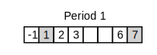

# Input file format

The td.py tool expects a json-formatted input file (see [Use](use.md)) that specifies the study elements to be rendered.

In general, the [json format](https://en.wikipedia.org/w/index.php?title=JSON&oldid=1065106487) has specific syntactic requirements in order to be read correctly by TD:

* All json elements are enclosed in curly brackets, including the complete input file
* Fields within elements have a name that must be enclosed in quotes, e.g., "caption", followed by a colon and the respective value
* Values can be numerical, character (i.e., enclosed in quotes), other json elements, or lists (enclosed in square brackets) of any of the previous
* Fields must be separated by commas, but there is no comma after the respective last element

The below overview specifies the specific expected format of the json-formatted input file to describe the trial design elements.

## Periods

On the highest level, clinical study elements within the input file are expected to be structured in _periods_ or _cycles_. Both options are possible and essentially equivalent.

As a minimum, each _period_ or _cycle_ element needs to have _caption_, _start_ and _duration_ fields. A minimum period "Period 1" that includes days 1 through 7 is described like this:

``` json
{
    "caption": "Period 1",
    "start": 1,
    "duration": 7
}
```

Note that the period definition is enclosed in curly brackets. In the json format, this is used to structure elements. You will see below that objects can themselves contain objects. In additino, some elements are grouped together in a list. Lists are delimited in square brackets. 


In the input file, periods, even if only one is defined, are expected as a _periods_ list. A minimal viable input file could look like this:

``` json
{
	"periods": [
        {
            "caption": "Period 1",
            "start": 1,
            "duration": 7
        }
    ]
}
```
The respective output is:


Further periods can be added as more members to _periods_, e.g.:

``` json
{
	"periods": [
        {
            "caption": "Period 1",
            "start": 1,
            "duration": 7
        },
        {
            "caption": "Period 2",
            "start": 1,
            "duration": 7
        }
    ]
}
```


### Period formatting

Additional fields can be added to the _period_ elements to specify the visual output. Each _period_ can have the following fields:

* _daylabels_, a list of days for which daynumbers will be printed.
* _dayshading_, a list of days for which the day box will have a grey background. This can be used to highlight relevant days, e.g., weekend days.

``` json
{
    "periods": [
        {
            "caption": "Period 1",
            "start": -1,
            "duration": 8,
            "daylabels": [-1, 1, 2, 3, 6, 7],
            "dayshading": [1, 7]
        }
    ]
}
```



!!! note
 
    Wherever lists of days are expected as the input to a field, there are different options. In the simplest case, a list of day numbers can be provided:

    ```
    [-1, 1, 2, 3, 5, 7]
    ```

    If subsequent days are to be specified, it may be more convenient to use a range format. Note that ranges need to be provided with enclosing double quotes. Individual days and ranges can be combined:

    ```
    [-1, "1-3", 5, 7]
    ```

## Period elements

To every _period_, elements can be appended. There are three classes of elements: _intervals_, _administrations_ and _procedures_. Individual elements of these classes must be given as a list of the respective types (see examples below). This results in a hierarchical structure of the input file where lists can have members that themselves may contain lists of child elements.

To better visualize the hierarchy, successive indentation levels are used in the json blocks shown in this documentation. Note that this is not a strict requirement for the json-formatted input file, however it is considered good practice.

The three element classes have different visual representations and may have different property fields. The following gives an overview on this.

### Intervals

Intervals are typically used to denote hospitalization phases or ambulatory visits, and are represented in the output as boxes spanning the respective days. There are two different ways of specifying intervals:

* For intervals that span multiple days, a _start_ and _duration_ must be given.

* For single-day intervals, a list of _days_ can be given instead. The duration is then assumed to be one day.

A valid example may look like this:

``` json
{
    "periods": [
        {
            "caption": "Period 1",
            "start": -1,
            "duration": 10,
            "daylabels": [-1, "1-9"],
            "intervals": [
                {
                    "caption": "hospitalization",
                    "start": -1,
                    "duration": 4
                },
                {
                    "caption": "ambulatory visit",
                    "days": [5, 7, 9]
                }
            ]
        }
    ]
}
```


### Administrations

IMP administrations are shown in the output using arrow symbols. The minimally required fields are _caption_ and _days_. As mentioned [above](#specifying-days), _days_ is expected to be a list of numbers or double-quoted day ranges. Both are used in the below example:

``` json
{
    "periods": [
        {
            "caption": "Period 1",
            "start": -1,
            "duration": 10,
            "daylabels": [-1, "1-9"],
            "administrations": [
                {
                    "caption": "aspirin",
                    "days": [1]
                },
                {
                    "caption": "paracetamole",
                    "days": [5, 6, 7]
                }
            ]
        },
        {
            "caption": "Period 2",
            "start": 10,
            "duration": 4,
            "daylabels": ["10-14"],
            "administrations": [
                {
                    "caption": "aspirin",
                    "days": [11]
                }
            ]
        }
    ]
}
```


### Procedures

All other study assessments (e.g., blood sampling, ECG, etc.) are specified as _procedures_.

In general, study procedures may be conducted once per day or multiple times per day. In the graphical representation, the respective symbols are diamonds and boxes. The frequency of a _procedure_ can be specified using the _freq_ field: "QD" indicates once daily, while "rich" indicates multiple daily time points. For "QD", the _freq_ field can also be omitted (e.g., for the ECG on day 5, below).

``` json
{
    "periods": [
        {
            "caption": "Period 1",
            "start": -1,
            "duration": 8,
            "daylabels": [-1, "1-7"],
            "procedures": [
                {
                    "caption": "ECG",
                    "days": [-1],
                    "freq": "QD"
                },
                {
                    "caption": "ECG",
                    "days": [5]
                },
                {
                    "caption": "ECG",
                    "days": [7],
                    "freq": "rich"
                }
            ]
        }
    ]
}
```


## Advanced notation

### Exact procedure times

As a more granular alternative to the rather coarse definition of the procedure frequency using the _freq_ field, precise preocedure times can be noted for procedures, e.g., for PK samplings. The times (in hours) is to be provided as a list to the _times_ field. In addition, a _relative_ field must be provided to clearly indicate to which day the times refer:

``` json
{
    "periods": [
        {
            "caption": "Period 1",
            "start": -1,
            "duration": 8,
            "daylabels": [-1, "1-7"],
            "procedures": [
                {
                    "caption": "ECG",
                    "days": [1],
                    "times": [0, 0.5, 1, 2, 4, 6, 8, 12, 24, 36, 48],
                    "relative": 1
                }
            ]
        }
    ]
}
```

This notation automatically assigns the right symbols for the days onto which the time points fall. In the above example, the time point list indicates that there are multiple time points on days 1 and 2 (leading to a box symbol for these days) but a single time point on day 2 (diamond symbol):


Sometimes, it is desirable to print a more detailed timeline for a procedure (e.g., to show the PK sampling schedule). This can be achieved by adding a _timescale_ field with the value "show". In addition, as described on the [Use](use.md) page, the commandline parameter `--timescale` (or short `-t`) must be set to achieve this.

``` json
{
    "periods": [
        {
            "caption": "Period 1",
            "start": -1,
            "duration": 8,
            "daylabels": [-1, "1-7"],
            "procedures": [
                {
                    "caption": "PK sampling",
                    "days": [1],
                    "times": [0, 0.5, 1, 2, 4, 6, 8, 12, 24, 36, 48],
                    "relative": 1,
                    "timescale": "show"
                }
            ]
        }
    ]
}
```


(Created by invoking: `python td.py -t sample.jpg`)

### Exact dose information

In some cases, the dose for an IMP changes over time in a scheduled way, e.g. to phase in or out a sensitive drug. In this cases, the respective administration element can include specific dosing information using a numerical _dose_ field. The below example shows a dose escalation for carbamazepine:

```json
"administrations": [
    {
        "caption": "carbamazepine BID",
        "days": ["8-9"],
        "dose": 100
    },
    {
        "caption": "carbamazepine BID",
        "days": ["10-11"],
        "dose": 200
    },
    {
        "caption": "carbamazepine BID",
        "days": ["12-32"],
        "dose": 300
    }
]
```
As detailed on the [Use](use.md#dose-graph) page, a dose graph can then be displayed in the output to indicate the dose over time using the "--graph" (or "-g") option.

### Other procedure symbols

In cases where prodecure symbols should indicate different conditions (e.g., fasted vs. fed), a _value_ field can be included in the procedure element. Procedures with a _value_ field are not shown as diamonds but as hollow circles if the value is zero, and filled circles for any value other than zero:

``` json
{
    "periods": [
        {
            "caption": "Period 1",
            "start": -1,
            "duration": 8,
            "daylabels": [-1, "1-7"],
            "procedures": [
                {
                    "caption": "food",
                    "days": [1],
                    "value": 0
                },
                {
                    "caption": "food",
                    "days": [5],
                    "value": 1
                }
            ]
        }
    ]
}
```


### Period highlighting

To visually make a period stand out, the _period_ element can include a _decoration_ field. Possible values are "highlighted" for a shaded background or "bracketed" to indicate, e.g., optional periods. Setting the value to "none" removes the effect, this can be used for quick testing purposes.

```json
{
    "periods": [
        {
            "caption": "Period 1",
            "start": -1,
            "duration": 5,
            "daylabels": [-1, "1-4"],
            "decoration": "highlighted",
            "procedures": [
                {
                    "caption": "massage",
                    "days": ["1-2"]
                }
            ]
        },
        {
            "caption": "Period 2",
            "start": 1,
            "duration": 4,
            "daylabels": ["1-4"],
            "procedures": [
                {
                    "caption": "massage",
                    "days": ["1-2"]
                }
            ]
        },
        {
            "caption": "Period 3",
            "start": 1,
            "duration": 4,
            "daylabels": ["1-4"],
            "decoration": "bracketed",
            "procedures": [
                {
                    "caption": "massage",
                    "days": [ "1-2"]
                }
            ]
        }
    ]
}
```


### Procedure labels

To annotate individual procedure instances, e.g., to give visits a unique identifier (see below) or to add details to a procedure on a certain day, the _labels_ field can be added to a procedure. Its value is expected to be a list of labels corresponding to the list of _days_ of that procedure. Labels are rendered in the output above the respective days. Lables can be added to intervals, administrations or procedures.

Note: If the procedure is an interval that is defined using _start_ and _duration_, that list is expected to contain only one label which is then displayed above the start day of the interval:

```json
{
    "periods": [
        {
            "caption": "Period 1",
            "start": -1,
            "duration": 10,
            "daylabels": [-1, "1-9"],
            "intervals": [
                {
                    "caption": "hospitalization",
                    "start": -1,
                    "duration": 4,
                    "labels": ["V1"]
                },
                {
                    "caption": "ambulatory visit",
                    "days": [5, 7, 9],
                    "labels": ["V2", "V3", "V4"]
                }
            ]
        }
    ]
}
```


### Footnotes

Footnotes can be added to any _interval_, _administration_ or _procedure_ field, defining an entry _footnotes_ that has a list as its value. The elements of that list need to have _day_, _symbol_ and _text_ entires that define the day to be annotated, the footnote symbol to be rendered above it, and the full text that is rendered at the bottom of the figure.

Footnote symbols can be re-used in other procedures. the _text_ field in further copies is expected to be an empty string (i.e., "").

Note that in the output, footnotes are only rendered if specified explicitly with the "--footnote" (or "-n") option (see [Use](use.md#footnotes)). The below figure was created by invoking `python td.py -n sample.jpg`:

``` json
{
    "periods": [
        {
            "caption": "Periods 1-3",
            "start": -1,
            "duration": 8,
            "daylabels": [-1, "1-7"],
            "procedures": [
                {
                    "caption": "ECG",
                    "days": [ 1, 2, 3, 7],
                    "footnotes": [
                        {
                            "day": 2,
                            "symbol": "a",
                            "text": "Period 1 only"
                        },
                        {
                            "day": 7,
                            "symbol": "b",
                            "text": "Before discharge"
                        }
                    ]
                },
                {
                    "caption": "vital signs",
                    "days": [-1, 5, 7],
                    "footnotes": [
                        {
                            "day": 5,
                            "symbol": "a",
                            "text": ""
                        }
                    ]
                }
            ]
        }
    ]
}
```

